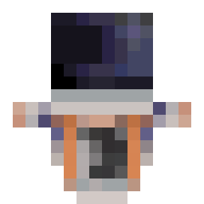
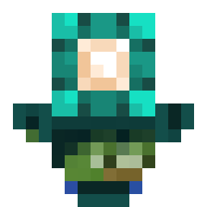
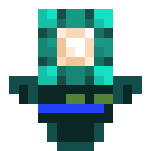

# wavy-totem-lib


Python library to generate totems of undying for Minecraft.

## Features

* Support 64x32 skins
* Zoning 2 layers and rounding the head
* Lossless scaling image size
* Asynchrony support
* Supports PyPy
* Supports different styles

## Installing

#### Using uv

```bash
uv add wavy-totem-lib
```

#### Using Poetry

```bash
poetry add wavy-totem-lib
```

#### Using pip

```bash
pip install wavy-totem-lib
```

## Quick start

```python
from wavy_totem_lib import TotemBuilder, Skin, Totem, TopLayer

builder = TotemBuilder(
    Skin('my_skin.png'),
    top_layers=[TopLayer.HEAD],  # the second layer will be applied only to the head
    round_head=True  # the head will be rounded at the corners
)

totem: Totem = builder.build()
totem.image.save('totem.png')  # .image is Pillow image
```

### More examples

<details>
<summary>Generation and scaling</summary>

```python
from wavy_totem_lib import TotemBuilder, Skin, Totem

builder = TotemBuilder(Skin('my_skin.png', slim=True))

totem: Totem = builder.build()
scaled = totem.scale(factor=8)  # Scaling from 16×16 to 128×128
scaled.save('totem.png')
```

> [!NOTE]
> To scale up, use the built-in `scale()` method instead of `resize()` from Pillow, because it may blur the image.

</details>

<details>
<summary>Asynchronous generation</summary>

```python
import asyncio
from io import BytesIO
from wavy_totem_lib import TotemBuilder, Skin, Totem, TopLayer
# To save a file asynchronously, install the aiofiles package
import aiofiles


async def main():
    builder = TotemBuilder(Skin('my_skin.png', slim=False),
                           top_layers=[TopLayer.HEAD, TopLayer.HANDS],
                           round_head=True)
    totem: Totem = await builder.build_async()
    temp = BytesIO()
    totem.image.save(temp, format='png')

    async with aiofiles.open('totem.png', 'wb') as f:
        await f.write(temp.getvalue())


asyncio.run(main())
```

</details>

<details>
<summary>Specifying a style</summary>

```python
from wavy_totem_lib import TotemBuilder, Skin, Totem, STTStyle

# WavyStyle (default), STTStyle available built-in
builder = TotemBuilder(Skin('my_skin.png'), style=STTStyle)
totem: Totem = builder.build()
totem.image.save('totem.png')
```

> [!NOTE]
> The `generate()` method accepts **kwargs, which will be passed on to the style class. None of the built-in styles
> support them.

</details>

## Styles

> [!NOTE]
> You can create your own styles by inheriting the `AbstractStyle` class and implementing the `image` property.

### Wavy

Class name: `WavyStyle`.
This is the default style in TotemBuilder.

| Notch (wide)                           | WavyCat (slim)                           | CyCeKu (wide)                           |
|----------------------------------------|------------------------------------------|-----------------------------------------|
|  |  |  |

```python
from wavy_totem_lib import TotemBuilder, WavyStyle

TotemBuilder(style=WavyStyle)
# You can also not specify style at all, because WavyStyle – default style.
```

### STT

Class name: `STTStyle`.
The code is taken from the [UnFamousSoul/STT](https://github.com/UnFamousSoul/STT) repository.

| Notch (wide)                          | WavyCat (slim)                          | CyCeKu (wide)                          |
|---------------------------------------|-----------------------------------------|----------------------------------------|
|  |  |  |

```python
from wavy_totem_lib import TotemBuilder, STTStyle

TotemBuilder(style=STTStyle)
```