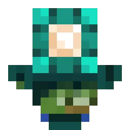
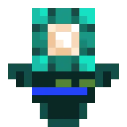

import {Badge} from '@astrojs/starlight/components';
import {Aside} from '@astrojs/starlight/components';

A Pattern is an algorithm that draws a totem based on a [skin](/concepts/skin/) and additional arguments.

The library includes two built-in patterns, but you can also create your own by inheriting from the Abstract class. For detailed information, see the [guide on writing a custom pattern](/guides/writing-pattern/).

## Built-in Patterns

<Aside>
    Currently, all built-in patterns do not process additional **kwargs arguments.
</Aside>

### Wavy

The original pattern by WavyCat. **This is the default pattern used by the builder.**

#### Examples

| [Notch](https://namemc.com/skin/5d5eb6d84b57ea29) <Badge text="wide" />   | [WavyCat](https://namemc.com/skin/1767a8d8e8323092) <Badge text="slim" />     | [CyCeKu](https://namemc.com/skin/231cdb46741fc108) <Badge text="wide" />    |
|---------------------------------------------------------------------------|-------------------------------------------------------------------------------|-----------------------------------------------------------------------------|
|  |  |  |

#### Usage

```py
from wavy_totem_lib import TotemBuilder
from wavy_totem_lib.patterns import Wavy

TotemBuilder(pattern=Wavy)

# Alternatively, you can omit the pattern entirely since Wavy is the default pattern:

TotemBuilder()
```

### STT

A pattern based on code by [UnFamousSoul](https://github.com/UnFamousSoul).

#### Examples

| [Notch](https://namemc.com/skin/5d5eb6d84b57ea29) <Badge text="wide" /> | [WavyCat](https://namemc.com/skin/1767a8d8e8323092) <Badge text="slim" />   | [CyCeKu](https://namemc.com/skin/231cdb46741fc108) <Badge text="wide" />  |
|-------------------------------------------------------------------------|-----------------------------------------------------------------------------|---------------------------------------------------------------------------|
|  |  |  |

#### Usage

```py
from wavy_totem_lib import TotemBuilder
from wavy_totem_lib.patterns import STT

TotemBuilder(pattern=STT)
```

## Core Properties and Methods

These properties and methods are available in all patterns inherited from Abstract.

* `skin`: `Skin` — contains the skin used as the basis for drawing the totem.
* `top_layers`: `List[TopLayer]` — a list of second layers (body parts) that should be rendered. By default, contains all layers.
* `**kwargs`: `Dict[str, Any]` — contains all additional arguments passed to the builder that were not used by the builder itself. Allows the pattern to accept additional arguments.
* `_canvas`: `PIL.Image` — the canvas on which the totem is drawn. Initially empty. Used by the `image()` method.
* `image()`: `PIL.Image` — renders and returns the totem image.