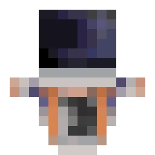
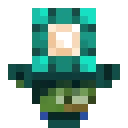
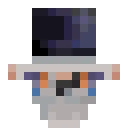
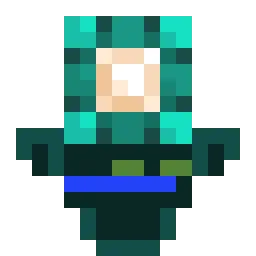

import {Badge} from '@astrojs/starlight/components';
import {Aside} from '@astrojs/starlight/components';

Паттерн — это алгоритм, который рисует тотем на основе [скина](/ru/concepts/skin/) и доп. аргументов.

В библиотеке уже есть два встроенных паттерна, но вы также можете создавать свои собственные, унаследовавшись от класса Abstract. Для подробной информации, посмотрите [инструкцию как создавать свой паттерн](/ru/guides/writing-pattern/).

## Встроенные паттерны

<Aside>
    На текущий момент все встроенные паттерны не обрабатывают доп. аргументы **kwargs.
</Aside>

### Wavy

Оригинальный паттерн от WavyCat. **Является паттерном по-умолчанию в билдере.**

#### Примеры

| [Notch](https://ru.namemc.com/skin/5d5eb6d84b57ea29) <Badge text="wide" />   | [WavyCat](https://ru.namemc.com/skin/1767a8d8e8323092) <Badge text="slim" />     | [CyCeKu](https://ru.namemc.com/skin/231cdb46741fc108) <Badge text="wide" />    |
|------------------------------------------------------------------------------|----------------------------------------------------------------------------------|--------------------------------------------------------------------------------|
|  |  |  |

#### Использование

```py
from wavy_totem_lib import TotemBuilder
from wavy_totem_lib.patterns import Wavy

TotemBuilder(pattern=Wavy)

# Либо можно не указывать паттерн вовсе, т.к. Wavy является паттерном по-умолчанию:

TotemBuilder()
```

### STT

Паттерн, написанный на основе кода от [UnFamousSoul](https://github.com/UnFamousSoul).

#### Примеры

| [Notch](https://ru.namemc.com/skin/5d5eb6d84b57ea29) <Badge text="wide" /> | [WavyCat](https://ru.namemc.com/skin/1767a8d8e8323092) <Badge text="slim" />   | [CyCeKu](https://ru.namemc.com/skin/231cdb46741fc108) <Badge text="wide" />  |
|----------------------------------------------------------------------------|--------------------------------------------------------------------------------|------------------------------------------------------------------------------|
|  |  |  |

#### Использование

```py
from wavy_totem_lib import TotemBuilder
from wavy_totem_lib.patterns import STT

TotemBuilder(pattern=STT)
```

## Базовые свойства и методы

Эти свойства и методы доступны во всех паттернах, унаследованных от Abstract.

* `skin`: `Skin` — содержит скин, на основе которого рисуется тотем.
* `top_layers`: `List[TopLayer]` — список вторых слоёв (частей тела), которые должны быть отрисованы. По-умолчанию содержит все слои.
* `**kwargs`: `Dict[str, Any]` — содержит все доп. аргументы, которые были переданы в билдер и не были использованы билдером. Позволяет паттерну принимать доп. аргументы.
* `_canvas`: `PIL.Image` — холст, на котором рисуется тотем. Изначально пустой. Используется в методе `image()`.
* `image()`: `PIL.Image` — рисует и возвращает изображение тотема.
